<!-- README.md is generated from README.Rmd. Please edit that file -->
<!-- badges: start -->

[](https://github.com/hypertidy/whatarelief/actions/workflows/R-CMD-check.yaml)
<!-- badges: end -->

# whatarelief

The goal of whatarelief is to obtain *raster* data, for exactly the map
that you want. No need to open, crop, resize, aggregate, call out to
command line or faff around with files or format.

There are raster sources, and whatarelief knows about online elevation
and imagery so you don’t have to, just specify what what you want. Any
extent, any projection.

``` r
library(whatarelief)
## in global Mercator projection Australia's box extent is 7100km  wide and 4500km high and its southwest 
## point is 11700km east and 5500km south of the prime meridian and equator
p0 <- c(11700000, -5500000)
ex <- rep(p0, each = 2L) + c(0, 7100000, 0, 4500000)

## 1024 is a enough to make a picture
dm <- c(1024, 1024 * 4.5/7.1)  ## set the aspect ratio so our dimensions match our extent proportions

img <- imagery(extent = ex, dimension = dm, projection = "EPSG:3857")
cst <- coastline(extent = ex, dimension = dm, projection = "EPSG:3857")
#> [1] "/vsicurl/https://public.services.aad.gov.au/datasets/science/GEBCO_2021_GEOTIFF/GEBCO_2021.tif"
ximage::ximage(img, extent = ex, asp = 1)
lines(cst, col = "saddlebrown")
```

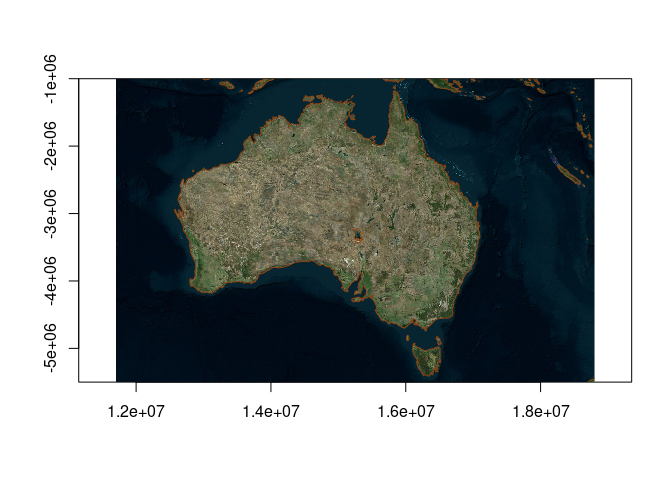

Please note that the hard part up there is get *six numbers*, these are
*extent: xmin,xmax,ymin,ymax* and *dimension: ncol,nrow*. Normally we
have these at hand, for example the state.center data set in R, and our
device size:

``` r
sc <- datasets::state.center
ex <- c(range(sc$x), range(sc$y))
dm <- dev.size("px")
img <- imagery(extent = ex, dimension = dm, projection = "OGC:CRS84", resample = "bilinear")
ximage::ximage(img, extent = ex, asp = 1/cos(mean(ex[3:4]) * pi/180))
points(sc$x, sc$y, col = "firebrick", pch = 19)
```

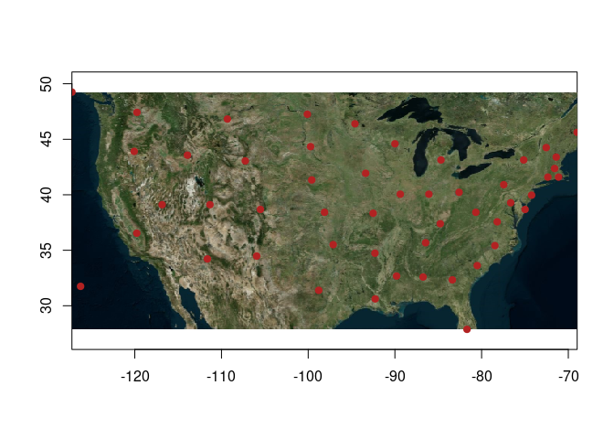

We have this example upfront because it’s the most important part, and
we don’t have helpers yet for choosing the right dimension. You are free
to do what you want.

There is a world full of online data sources for bio/physical variables,
elevation, and imagery, and we of course use the GDAL warper app lib as
the most general and convenient engine for working with raster sources.
There is no grand catalogue of these sources or how to use them, so we
left that for later, grabbed some sources and made some helpers.

Here you’ll find functions with clear names about what they provide.

-   [elevation()](https://hypertidy.github.io/whatarelief/reference/elevation.html)
-   [imagery()](https://hypertidy.github.io/whatarelief/reference/imagery.html)
-   [streetmap()](https://hypertidy.github.io/whatarelief/reference/imagery.html)
-   [coastline()](https://hypertidy.github.io/whatarelief/reference/coastline.html)

They aren’t really specific to their name, `elevation()` for example can
look up any raster data source (file, url, anything GDAL understands),
just use the ‘source’ argument. This also means we don’t have to use the
online sources, just provide whatever you want. Generally, `elevation()`
will get a matrix (a single band) of numeric raster data, and
`imagery()` and `streetmap()` will get a matrix of colour data (usually
from 3 or 4 bands).

`elevation()` defaults to global elevation data from GEBCO, and will
include higher resolution SRTM for small regions. `imagery()` and
`streetmap()` default to satellite+aerial imagery, and drawings of
street layers respectively.

`coastline()` generates coordinates from a elevation source at level =
0, to give a “coast line” of sorts.

All of these functions have arguments *extent*, *dimension*,
*projection* - the three key components that make up a raster. Specify
these three components to get what you want. Every single spatial object
you use has an extent (xmin,xmax,ymin,ymax) and a projection (crs), you
can pick anything for dimension (but 1024x1024 is enough to make a
picture, for example).

We have been careful to align to the *raster orientation*, which in R is
the `rasterImage()` convention, this matches the order in which the data
are returned but still requires care because it’s confusing.

We don’t like that `rasterImage()` and its second cousin `image()` have
a different set of incomplete features with these different
orientations, so we use the helper
[ximage()](httsp://github.com/hypertidy/whatarelief.git) so we can work
easily at a high level for visualization.

## Installation

You can install the development version of whatarelief from
[Github](https://github.com/hypertidy/whatarelief) with:

``` r
remotes::install_github("hypertidy/whatarelief")
```

## Get elevation data

Whole planet by default, specify an extent to hone this, use ‘dimension’
and ‘projection’ for more custom options.

``` r
library(whatarelief)
im <- elevation()  ## orientation is wrong for image() but correct for rasterImage()
#> [1] "/vsicurl/https://public.services.aad.gov.au/datasets/science/GEBCO_2021_GEOTIFF/GEBCO_2021.tif"
image(t(im[nrow(im):1, ]))
```


We don’t want this special handling, so use the
[ximage](https://github.com/hypertidy/ximage) package functions
`ximage()` and `xcontour()` 🚀.

``` r
library(ximage)
ximage(im, extent = c(-180, 180, -90, 90))
```

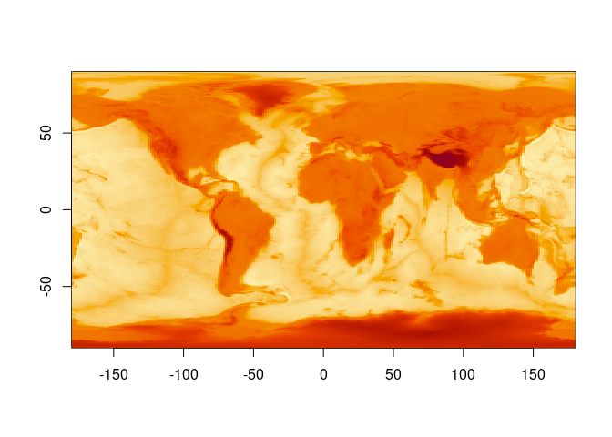

``` r


ex <- c(120, 160, 30, 50)
x0 <- elevation(extent = ex)
#> [1] "/vsicurl/https://public.services.aad.gov.au/datasets/science/GEBCO_2021_GEOTIFF/GEBCO_2021.tif"
ximage(x0, col = hcl.colors(24), extent = ex)
xcontour(x0, add = TRUE, levels = 10, extent = ex)
```

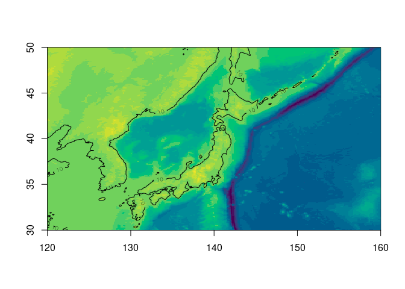

``` r


ximage(elevation(extent = c(120, 160, 30, 50), dimension = dev.size("px")))
#> [1] "/vsicurl/https://public.services.aad.gov.au/datasets/science/GEBCO_2021_GEOTIFF/GEBCO_2021.tif"
```

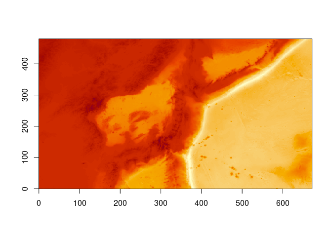

``` r

ximage(elevation(extent = c(120, 160, -50, -20), dimension = c(60, 85), resample = "near"))
#> [1] "/vsicurl/https://public.services.aad.gov.au/datasets/science/GEBCO_2021_GEOTIFF/GEBCO_2021.tif"
```

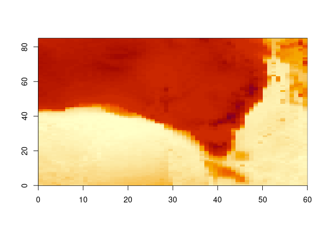

``` r

ex <- c(-1, 1, -1, 1) * 5e6
ximage(elevation(extent = ex, projection = "+proj=lcc +lon_0=-85 +lat_0=-42 +lat_1=0 +lat_2=-30"), extent = ex)
#> [1] "/vsicurl/https://public.services.aad.gov.au/datasets/science/GEBCO_2021_GEOTIFF/GEBCO_2021.tif"
```

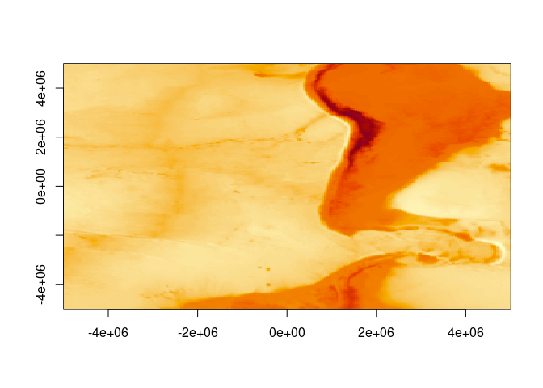

Can use a raster object.

``` r
elevation(terra::rast())
#> [1] "/vsicurl/https://public.services.aad.gov.au/datasets/science/GEBCO_2021_GEOTIFF/GEBCO_2021.tif"
#> class       : SpatRaster 
#> dimensions  : 180, 360, 1  (nrow, ncol, nlyr)
#> resolution  : 1, 1  (x, y)
#> extent      : -180, 180, -90, 90  (xmin, xmax, ymin, ymax)
#> coord. ref. : lon/lat WGS 84 
#> source(s)   : memory
#> name        : lyr.1 
#> min value   : -7189 
#> max value   :  5332

template <- terra::rast(terra::ext(c(-1, 1, -1, 1) * 5e6), crs = "+proj=lcc +lon_0=-85 +lat_0=-42 +lat_1=0 +lat_2=-30", ncols = 1024, nrows = 1024)
r <- elevation(template)
#> [1] "/vsicurl/https://public.services.aad.gov.au/datasets/science/GEBCO_2021_GEOTIFF/GEBCO_2021.tif"
r
#> class       : SpatRaster 
#> dimensions  : 1024, 1024, 1  (nrow, ncol, nlyr)
#> resolution  : 9765.625, 9765.625  (x, y)
#> extent      : -5e+06, 5e+06, -5e+06, 5e+06  (xmin, xmax, ymin, ymax)
#> coord. ref. : +proj=lcc +lat_0=-42 +lon_0=-85 +lat_1=0 +lat_2=-30 +x_0=0 +y_0=0 +datum=WGS84 +units=m +no_defs 
#> source(s)   : memory
#> name        : lyr.1 
#> min value   : -7937 
#> max value   :  5579

terra::plot(r)
```

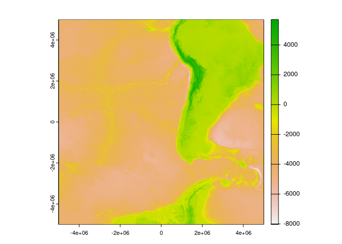

Works down to quite high resolution.

``` r
pt <- c(151.2093, -33.8688)
ex <- c(-1, 1, -1, 1) * 0.01 + rep(pt, each = 2L)
elev <- elevation(extent = ex)
#> [1] "SRTM in use, in addition to GEBCO"
#> [1] "/vsicurl/https://public.services.aad.gov.au/datasets/science/GEBCO_2021_GEOTIFF/GEBCO_2021.tif"
#> [2] "/vsicurl/https://opentopography.s3.sdsc.edu/raster/COP30/COP30_hh.vrt"
ximage(elev, zlim = c(0, max(elev)), extent = ex)
```


Similar example, but a bit more context so we can easily see that it’s
“correct”, by respatializing!

``` r
ex <- c(-1, 1, -1, 1) * 0.1 + rep(pt, each = 2L)
elev <- elevation(extent = ex)
#> [1] "SRTM in use, in addition to GEBCO"
#> [1] "/vsicurl/https://public.services.aad.gov.au/datasets/science/GEBCO_2021_GEOTIFF/GEBCO_2021.tif"
#> [2] "/vsicurl/https://opentopography.s3.sdsc.edu/raster/COP30/COP30_hh.vrt"
ximage(elev, zlim = c(0, max(elev)), extent = ex)
xcontour(elev,  extent = ex, levels = 5, add = TRUE)
```

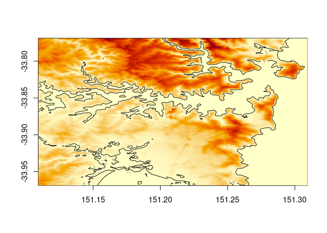

We can “re-spatialize”, but no special functionality is added we just
use the available tools.

``` r
library(terra)
#> terra 1.6.33
## note the data come out in rasterImage order, so the columns/rows are switched here
template <- terra::rast(terra::ext(ex), ncols = dim(elev)[2L], nrows = dim(elev)[1L], crs = "OGC:CRS84")
plot(setValues(template, elev))


plot(sf::st_cast(ozmaps::abs_ced, "MULTILINESTRING"), add = TRUE, col = "black")
```


Note that all the information we need is present, we provide the extent,
and the result has a dimension. (Longitude/latitude is assumed if
sensible, else there’s a warning - but the code will run what you ask of
it). Provide all the information extent, dimension, projection to get a
controlled result, or use a raster or terra object to store these.

## Custom sources

We can provide our own sources of elevation.

Use the ‘source’ argument to `elevation()`, you can input multiple
sources so that a higher resolution one has a fallback to a lower
resolution one, note that by default we have “GEBCO 2021”, then
“Copernicus GLO-30” in the sources. It doesn’t matter what projection or
extent these have, but usually a higher resolution one should be listed
after lower.

For example, this string provides the Amazon compute S3 elevation tiles,
an ‘XYZ’ image server that has geotiff elements but is not a
georeferenced online service (hence this small bit of XML to wrap it
up).

``` r
aws <- "<GDAL_WMS><Service name=\"TMS\"><ServerUrl>https://s3.amazonaws.com/elevation-tiles-prod/geotiff/${z}/${x}/${y}.tif</ServerUrl></Service><DataWindow><UpperLeftX>-20037508.34</UpperLeftX><UpperLeftY>20037508.34</UpperLeftY><LowerRightX>20037508.34</LowerRightX><LowerRightY>-20037508.34</LowerRightY><TileLevel>14</TileLevel><TileCountX>1</TileCountX><TileCountY>1</TileCountY><YOrigin>top</YOrigin></DataWindow><Projection>EPSG:3857</Projection><BlockSizeX>512</BlockSizeX><BlockSizeY>512</BlockSizeY><BandsCount>1</BandsCount><DataType>Int16</DataType><ZeroBlockHttpCodes>403,404</ZeroBlockHttpCodes><DataValues><NoData>-32768</NoData></DataValues><Cache/></GDAL_WMS>"
```

Using this, we can obtain a global summary of the available data. Sadly,
these data are not quite global.

``` r
m <- elevation(source = aws)
## we can use the old ways, just get the orientation right :)
image(seq(-180, 180, length.out = ncol(m)), seq(-90, 90, length.out = nrow(m)), t(m[nrow(m):1, ]), asp = 1)
maps::map(add = TRUE)
abline(h = c(-90, 90), lwd = 2)
```


``` r

ex <- c(-1, 1, -1, 1) * 1e7
ximage(elevation(extent = ex, projection = "+proj=laea +lat_0=-90", source = aws), asp = 1, extent = ex)
```

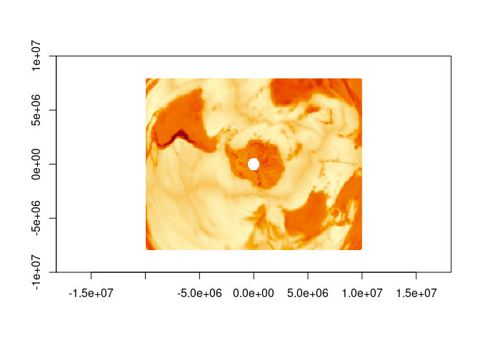

But, we can fall back to our GEBCO 2021 source to fill the gap even with
a custom source (note we can provide any number of sources, in any mix
of extents and projections and resolutions).

``` r
gebco <- "/vsicurl/https://public.services.aad.gov.au/datasets/science/GEBCO_2021_GEOTIFF/GEBCO_2021.tif"
m <- elevation(source = c(gebco, aws))
ximage(m, extent = c(-180, 180, -90, 90), asp = 1)
maps::map(add = TRUE)
abline(h = c(-90, 90), lwd = 2)
```


``` r

ximage(elevation(extent = c(-1, 1, -1, 1) * 1e7, projection = "+proj=laea +lat_0=-90", source = c(gebco, aws)), extent = c(-1, 1, -1, 1) * 1e7)
```


## Get coastlines

``` r
cst <- coastline(extent = c(-180, 180, -90, 0))
#> [1] "/vsicurl/https://public.services.aad.gov.au/datasets/science/GEBCO_2021_GEOTIFF/GEBCO_2021.tif"
plot(cst, type = "b", pch = ".")
```

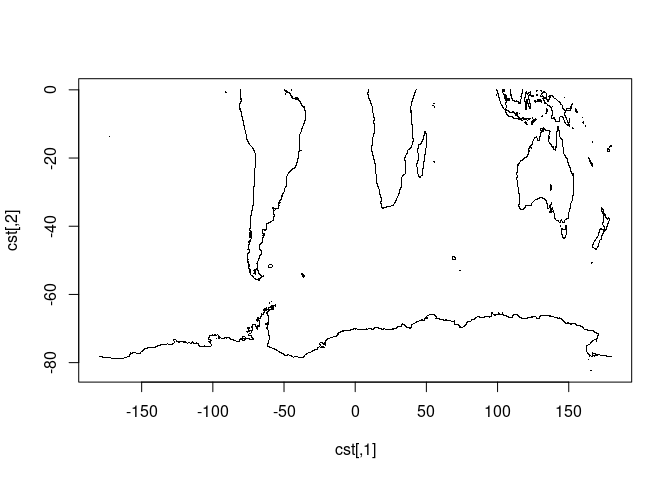

## Properties of the sources in use

See vignette
[elevation-sources](https://hypertidy.github.io/whatarelief/articles/elevation-sources.html).

Note that, we could use any raster data of any kind here as custom
’source’s … (we’re figuring out how to frame this package in general
terms, that aren’t too “spatial”).

## Experimental features

We are working out some ways of accessing data used by the raadtools
project.

Please don’t rely on them, not working ATM (very WIP in our raadtools
project too).

``` r
library(whatarelief)
files <- raad_source("nsidc_25km_seaice")
names(files)
idx <- which.max(files$date)

mat <- elevation(source = unlist(files[idx, c("north_vrt_dsn", "south_vrt_dsn")]))
brks <- quantile(mat[mat <= 250 & mat > 0], seq(0, 1, length.out = 16))
ximage(mat, col = grey.colors(length(brks) - 1), breaks = brks, main = files$date[idx])
```

## Code of Conduct

Please note that the whatarelief project is released with a [Contributor
Code of
Conduct](https://contributor-covenant.org/version/2/0/CODE_OF_CONDUCT.html).
By contributing to this project, you agree to abide by its terms.
