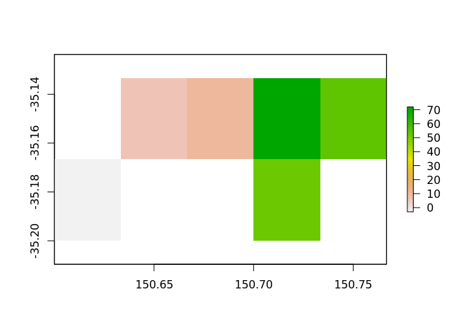
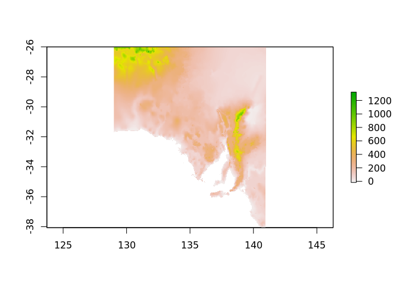

<!-- README.md is generated from README.Rmd. Please edit that file -->

# whatarelief

The goal of whatarelief is to build a set of raster tiles from a
topography raster based on polygons.

BEWARE: this is purely a proof of concept, not functional yet. These
functions will blithely download data and use your disk space in messy
ways …

## Installation

You can install the development version of whatarelief from
[Github](https://github.com/mdsumner/whatarelief) with:

``` r
devtools::install_github("mdsumner/whatarelief")
```

## Example

This is a basic example which shows you how to solve a common problem:

<https://ropensci.org/blog/2018/11/13/antarctic/>

``` r
library(blueant)
#> Loading required package: bowerbird
src <-   sources("ETOPO2 bathymetry")

library(whatarelief)
result <- get_relief(src)

topo <- raster::raster(find_relief())
#> Loading required namespace: ncdf4

library(ozmaps)
#> Loading required package: tibble
polys <- ozmaps::ozmap_data("states")
#> returning `sf` data format
#>  to use/plot ensure `sf` package is installed, then `library(sf)`

library(sf)
#> Linking to GEOS 3.6.2, GDAL 2.3.2, PROJ 4.9.3
x <- relief_patcher(as(polys, "Spatial"), topo, pname = "first_successful_run")

library(raster)
#> Loading required package: sp
purrr::walk(x, plot)
```



Please note that the ‘whatarelief’ project is released with a
[Contributor Code of Conduct](CODE_OF_CONDUCT.md). By contributing to
this project, you agree to abide by its terms.
